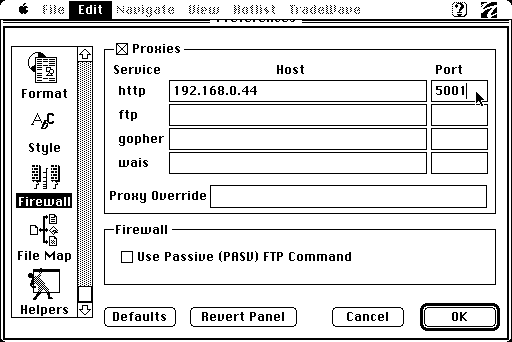

## MacProxy Plus
An extensible HTTP proxy that connects early computers to the Internet.

This fork of <a href="https://github.com/rdmark/macproxy">MacProxy</a> adds support for ```extensions```, which intercept requests for specific domains to serve simplified HTML interfaces, making it possible to browse the modern web from vintage hardware. Though originally designed for compatibility with early Macintoshes, MacProxy Plus should work to get many other vintage machines online.

### Demonstration Video (on YouTube)

<a href="https://youtu.be/f1v1gWLHcOk" target="_blank">
  
</a>

### Extensions

Each extension has its own folder within the `extensions` directory. Extensions can be individually enabled or disabled via a `config.py` file in the root directory.

To enable extensions:

1. In the root directory, rename ```config.py.example``` to ```config.py``` :

	```shell
	mv config.py.example config.py
	```

2. In ```config.py```, enable/disable extensions by uncommenting/commenting lines in the ```ENABLED_EXTENSIONS``` list:

	```python
	ENABLED_EXTENSIONS = [
		#disabled_extension,
		"enabled_extension"
		]
	```

### Starting MacProxy Plus

On Unix-like systems (such as Linux or macOS), run the ```start_macproxy.sh``` script. It will create a Python virtual environment, install the required Python packages, and make the proxy server available on your local network.

```shell
./start_macproxy.sh
```

On Windows, run the analogous PowerShell script, ```start_macproxy.ps1```:

```powershell
.\start_macproxy.ps1
```

### Connecting to MacProxy Plus from your Vintage Machine
To use MacProxy Plus, you'll need to configure your vintage browser or operating system to connect to the proxy server running on your host machine. The specific steps will vary depending on your browser and OS, but if your system lets you set a proxy server, it should work.

If you're using a BlueSCSI to get a vintage Mac online, <a href="https://bluescsi.com/docs/WiFi-DaynaPORT">this guide</a> should help with the initial Internet setup.
<br><br>


*Example: Configuring proxy settings in <a href="https://github.com/hunterirving/macweb-2.0c-plus">MacWeb 2.0c+</a>*

### Example Extension: ChatGPT

A ChatGPT extension is provided as an example. This extension serves a simple web interface that lets users interact with OpenAI's GPT models.

To enable the ChatGPT extension, open ```config.py```, uncomment the ```chatgpt``` line in the ```ENABLED_EXTENSIONS``` list, and replace ```YOUR_OPENAI_API_KEY_HERE``` with your actual OpenAI API key.

```python
open_ai_api_key = "YOUR_OPENAI_API_KEY_HERE"

ENABLED_EXTENSIONS = [
	"chatgpt"
]
```

Once enabled, Macproxy will reroute requests to ```http://chatgpt.com``` to this inteface.
<br><br>


### Other Extensions

#### Claude (Anthropic)
For the discerning LLM connoisseur.

#### Weather
Get the forecast for any zip code in the US.

#### Wikipedia
Read any of over 6 million encyclopedia articles - complete with clickable links and search function.

#### Reddit
Browse any subreddit or the Reddit homepage, with support for nested comments and downloadable images... in dithered black and white.

#### WayBack Machine
Enter any date between January 1st, 1996 and today, then browse the web as it existed at that point in time. Includes full download support for images and other files backed up by the Internet Archive.

#### Web Simulator
Type a URL that doesn't exist into the address bar, and Anthropic's Claude 3.5 Sonnet will interpret the domain and any query parameters to generate an imagined version of that page on the fly. Each HTTP request is serialized and sent to the AI, along with the full HTML of the last 3 pages you visited, allowing you to explore a vast, interconnected, alternate reality Internet where the only limit is your imagination.

#### (not) YouTube
A legally distinct parody of YouTube, which uses the fantastic homebrew application <a href="https://www.macflim.com/macflim2/">MacFlim</a> (created by Fred Stark) to encode video files as a series of dithered black and white frames.

#### Hackaday
A pared-down, text-only version of hackaday.com, complete with articles, comments, and search functionality.

#### npr.org
Serves articles from the text-only version of the site (```text.npr.org```) and transforms relative urls into absolute urls for compatibility with MacWeb 2.0.

#### wiby.me
Browse Wiby's collection of personal, handmade webpages (fixes an issue where clicking "surprise me..." would not redirect users to their final destination).

### Future Work
- more extensions for more sites
- presets targeting specific vintage machines/browsers
- wiki with how-to guides for different machines

Happy Surfing 😎